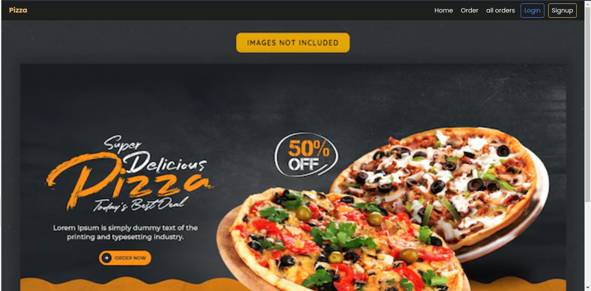

##  Pizza delivery project
A simple mock  application built with django, for ordering pizza 
## features
#### 1. Authentication
        1. user can register with email and user and login using username and password
#### 2. Order
        1. authenticated user can order pizza; provide toppings and size of the pizza
        2. authenticated user can also edit order
#### 3. view orders
        1. authenticated user can view and delete orders 

# images 
## Desktop view
###  Authentication

## mobile view

